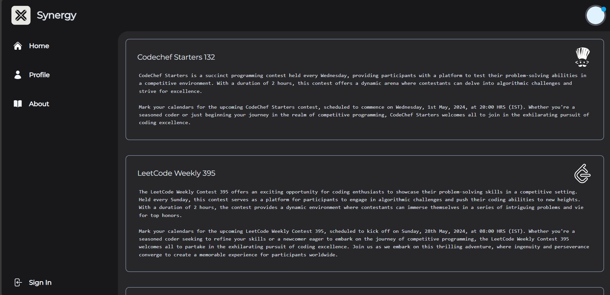
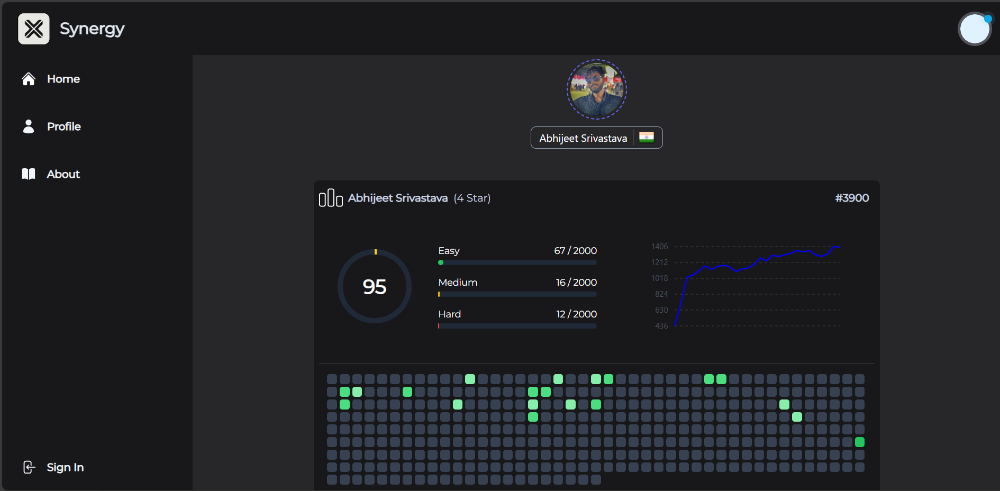
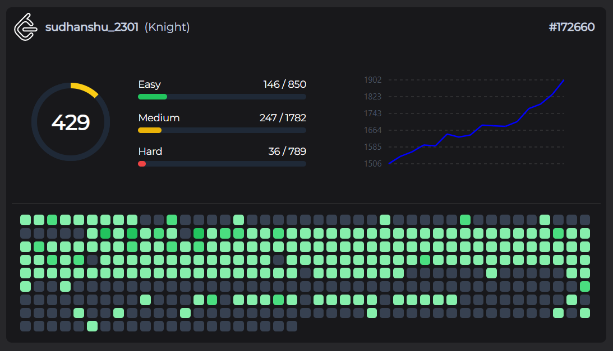

# Synergy


Synergy is a comprehensive web application designed for coding enthusiasts and hiring teams. It provides a unified platform to view upcoming coding contests and showcases detailed user coding profiles. By aggregating data from multiple coding platforms, Synergy helps hiring managers assess candidates' coding and data structure & algorithm (DSA) skills while promoting fair play through anti-plagiarism mechanisms.



## Key Features

- **Upcoming Coding Contests**: Stay updated with a schedule of upcoming coding contests from popular platforms.
- **User Profiles**:
  - Display contest ratings and progress over time.
  - 
  - Heatmap visualization of coding activity.
  - 
  - Questions solved and coding history.
  - Badges and achievements.
- **Hiring Team Tools**:
  - Insights into candidates' coding skills and consistency.
  - Visual ranking representations to compare candidates.
  - Under Development:
    - **Honesty Score**: A measure to evaluate coding integrity.
    - **Plagiarism Check**: Detect and flag copied code submissions.
    - **Quality of Questions**: Metrics to assess problem-solving depth.
    - **Custom Badges**: Personalized badges for notable achievements.

## Technologies Used

- **Backend**: Python, Django
- **Authentication**: django-allauth
- **Frontend**: Tailwind CSS
- **APIs Utilized**:
  - CodeChef API (Third Party)
  - Codeforces Public Endpoint
  - LeetCode GraphQL API

## How It Works

1. **Data Fetching**: API & Endpoint integrations allow fetching and summarizing data from CodeChef, Codeforces, and LeetCode.
2. **Data Processing**: Filters and aggregates data to generate user insights.
3. **Visualization**: Displays interactive charts and heatmaps for user activity and performance.

## Setup Instructions

1. Clone this repository:
   ```bash
   git clone https://github.com/your-username/synergy.git
   cd synergy
   ```
2. Create a virtual environment and activate it:
   ```bash
   python3 -m venv env
   source env/bin/activate  # On Windows use `env\Scripts\activate`
   ```
3. Install the dependencies:
   ```bash
   pip install -r requirements.txt
   ```
4. Set up environment variables for API keys and secrets.
5. Run database migrations:
   ```bash
   python manage.py migrate
   ```
6. Start the development server:
   ```bash
   python manage.py runserver
   ```
7. Access the application at `http://127.0.0.1:8000/`.


## Contact

For questions or suggestions, please reach out via email: abhijeet.afk@gmail.com.

